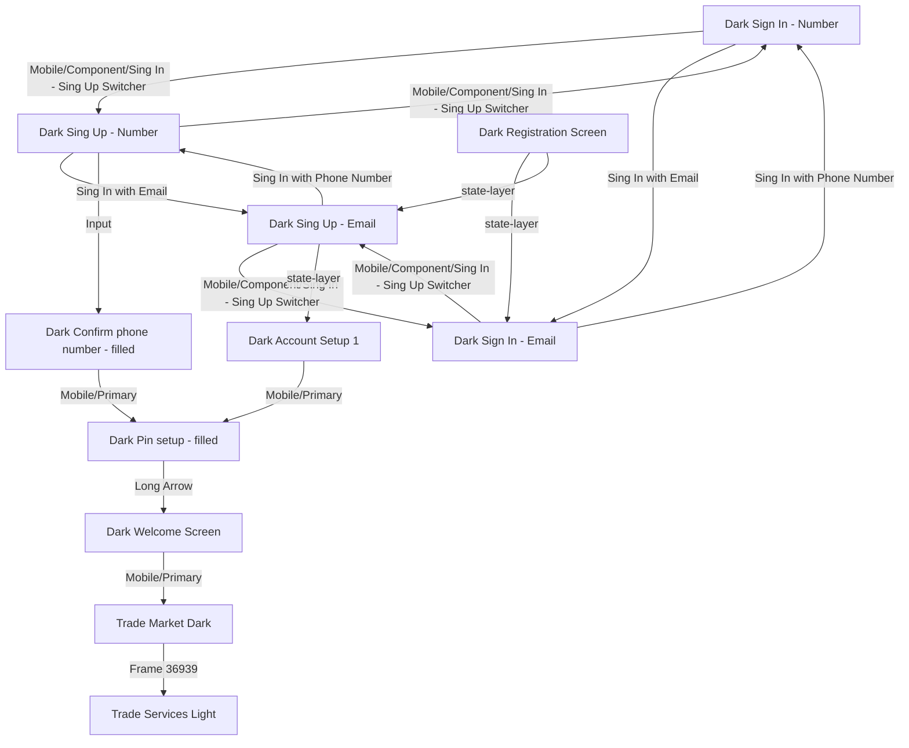

# 增强版用户流程图

## 📝 用户流程描述

从「Dark Sign In - Number」的「Mobile/Component/Sing In - Sing Up Switcher」(INSTANCE)跳转到「Dark Sing Up - Number」
从「Dark Sign In - Number」的「Sing In with Email」(TEXT)跳转到「Dark Sign In - Email」
从「Dark Sign In - Email」的「Mobile/Component/Sing In - Sing Up Switcher」(INSTANCE)跳转到「Dark Sing Up - Email」
从「Dark Sign In - Email」的「Sing In with Phone Number」(TEXT)跳转到「Dark Sign In - Number」
从「Dark Sing Up - Number」的「Mobile/Component/Sing In - Sing Up Switcher」(INSTANCE)跳转到「Dark Sign In - Number」
从「Dark Sing Up - Number」的「Sing In with Email」(TEXT)跳转到「Dark Sing Up - Email」
从「Dark Sing Up - Number」的「Input」(FRAME)跳转到「Dark Confirm phone number - filled」
从「Dark Sing Up - Email」的「Mobile/Component/Sing In - Sing Up Switcher」(INSTANCE)跳转到「Dark Sign In - Email」
从「Dark Sing Up - Email」的「Sing In with Phone Number」(TEXT)跳转到「Dark Sing Up - Number」
从「Dark Sing Up - Email」的「state-layer」(FRAME)跳转到「Dark Account Setup 1」
从「Dark Registration Screen」的「state-layer」(FRAME)跳转到「Dark Sign In - Email」
从「Dark Registration Screen」的「state-layer」(FRAME)跳转到「Dark Sing Up - Email」
从「Dark Welcome Screen」的「Mobile/Primary」(INSTANCE)跳转到「Trade Market Dark」
从「Dark Pin setup - filled」的「Long Arrow」(INSTANCE)跳转到「Dark Welcome Screen」
从「Dark Confirm phone number - filled」的「Mobile/Primary」(INSTANCE)跳转到「Dark Pin setup - filled」
从「Dark Account Setup 1」的「Mobile/Primary」(INSTANCE)跳转到「Dark Pin setup - filled」
从「Trade Market Dark」的「Frame 36939」(FRAME)跳转到「Trade Services Light」

## 📊 Mermaid 流程图

